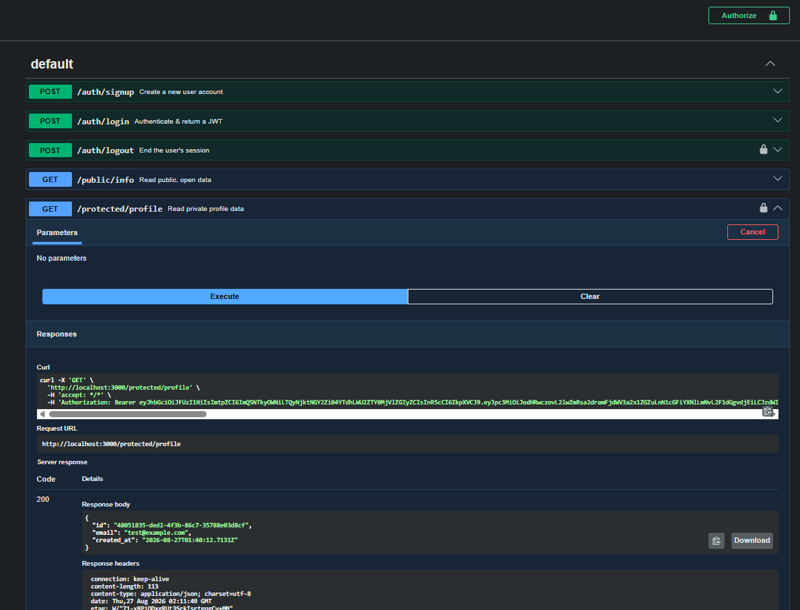
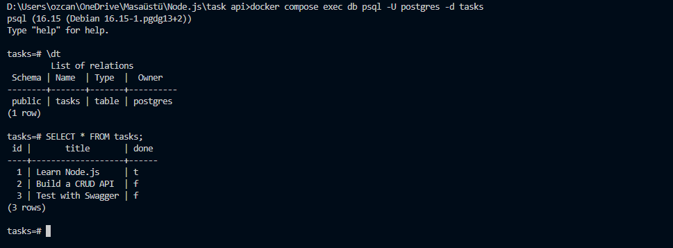

# Basic Task CRUD API

A secure API built with Node.js, Express, and PostgreSQL, featuring robust user authentication managed by Supabase. This project implements secure Sign Up, Log In, and Log Out flows, and protects specific endpoints using JWT (JSON Web Tokens) verification.

## How to Install & Run 

This project runs the entire stack (API + Database) with a single Docker command.

1. First, create your environment file by copying the example provided:
   `cp .env.example .env` (or manually copy the contents of `.env.example` into a new `.env` file).
2. Open the .env file and replace your_supabase_url and your_supabase_key with your actual Supabase project credentials.
3. Start the application and the database together:

```bash
docker compose up
```
## Table of Endpoints

| Task                        | HTTP method     | Endpoint                 | Auth Required?         |
|:----------------------------|:----------------|:-------------------------|:-----------------------|
| Get all tasks               | GET             | /tasks                   | No                     |
| Get single task             | GET             | /tasks/:id               | No                     |
| Add a new task              | POST            | /tasks                   | No                     |
| Update a task               | PUT             | /tasks/:id               | No                     |
| Delete a task               | DELETE          | /tasks/:id               | No                     |
| Create a user               | POST            | /auth/signup             | No                     |
| Authenticate                | POST            | /auth/login              | No                     |
| Logout                      | POST            | /auth/logout             | YES (Bearer Token)     |
| Read open data              | GET             | /public/info             | No                     |
| Read private                | GET             | /protected/profile       | YES (Bearer Token)     |
| Read private dashboard      | GET             | /protected/dashboard     | YES (Bearer Token)     |


## Example curl -i output
D:\Users\ozcan\OneDrive\Masaüstü\Node.js\task api>curl -i -X POST http://localhost:3000/auth/login -H "Content-Type: application/json" -d "{\"email\":\"test@example.com\",\"password\": \"password123\"}" 
HTTP/1.1 200 OK
X-Powered-By: Express
Content-Type: application/json; charset=utf-8
Content-Length: 970
ETag: W/"3ca-/+/m04Jgwgme+c5t8eAjGNrswdc"
Date: Thu, 27 Aug 2026 01:51:30 GMT
Connection: keep-alive
Keep-Alive: timeout=5

{"access_token":"eyJhbGciOiJFUzI1NiIsImtpZCI6ImQ5NTkyOWNiLTQyNjktNGY2Zi04YTdhLWU2ZTY0MjVlZGIyZCIsInR5cCI6IkpXVCJ9.eyJpc3MiOiJodHRwczovL2lwZmRsa2dramFjdWV3a2x1ZGZuLnN1cGFiYXNlLmNvL2F1dGgvdjEiLCJzdWIiOiI0ODA1MTgzNS1kZWQyLTRmM2ItODZjNy0zNTc4OGUwM2Q4Y2YiLCJhdWQiOiJhdXRoZW50aWNhdGVkIiwiZXhwIjoxNzg3Nzk5MDkwLCJpYXQiOjE3ODc3OTU0OTAsImVtYWlsIjoidGVzdEBleGFtcGxlLmNvbSIsInBob25lIjoiIiwiYXBwX21ldGFkYXRhIjp7InByb3ZpZGVyIjoiZW1haWwiLCJwcm92aWRlcnMiOlsiZW1haWwiXX0sInVzZXJfbWV0YWRhdGEiOnsiZW1haWwiOiJ0ZXN0QGV4YW1wbGUuY29tIiwiZW1haWxfdmVyaWZpZWQiOnRydWUsInBob25lX3ZlcmlmaWVkIjpmYWxzZSwic3ViIjoiNDgwNTE4MzUtZGVkMi00ZjNiLTg2YzctMzU3ODhlMDNkOGNmIn0sInJvbGUiOiJhdXRoZW50aWNhdGVkIiwiYWFsIjoiYWFsMSIsImFtciI6W3sibWV0aG9kIjoicGFzc3dvcmQiLCJ0aW1lc3RhbXAiOjE3ODc3OTU0OTB9XSwic2Vzc2lvbl9pZCI6IjliZmFhNmY1LWVlODMtNDQzMy04NDBkLTQwMmQ5ZDQ4YWE2NyIsImlzX2Fub255bW91cyI6ZmFsc2V9.ExrBRQaxO6nCVd6bK0CoJQ-XXmgoP9MHm-o8vtHnaa2JNmjANRQN7zIsF8aYK7imVK6HYD_sCuHBltsg92DYgw","refresh_token":"a7fcz6nxhwv6"}


## Swagger screenshot with JWT


## PostgreSQL Database Proof
