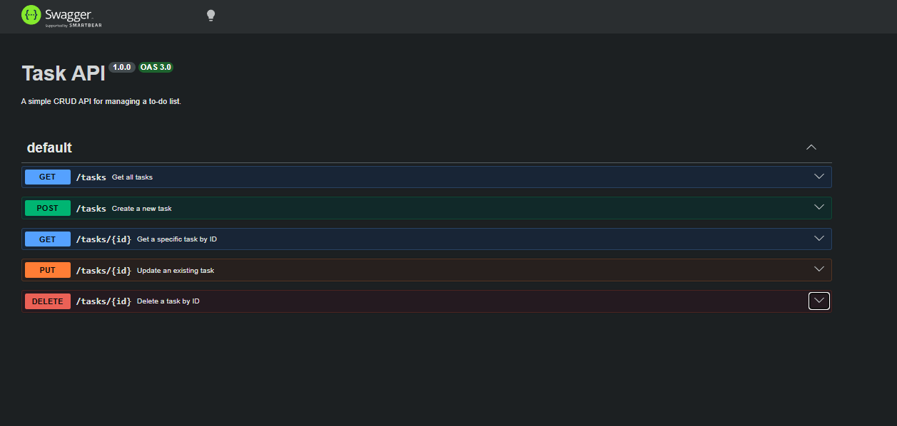
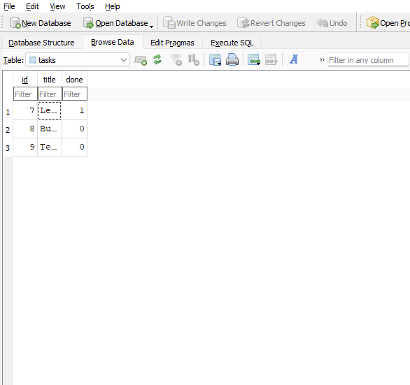
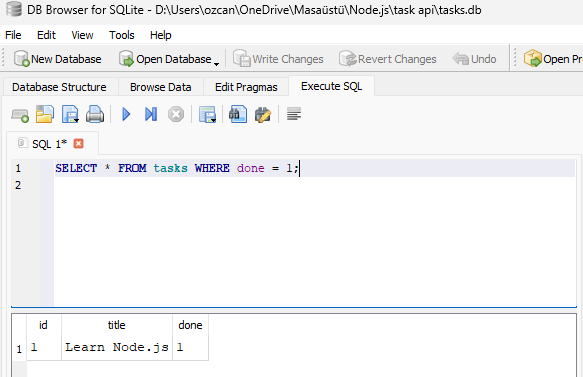

# Basic Task CRUD API

Basic in-memory to-do list CRUD API using Node.js and Express.js.

## How to Install & Run 

Use these commands to run this project:

```bash
npm install
node index.js
```
## Table of Endpoints

| Task           | HTTP method     | Endpoint       |
|:---------------|:----------------|:---------------|
| Get all tasks  | GET             | /tasks         |
| Get single task| GET             | /tasks/:id     |
| Add a new task | POST            | /tasks         |
| Update a task  | PUT             | /tasks/:id     |
| Delete a task  | DELETE          | /tasks/:id     |


## Example curl -i output
D:\Users\ozcan\OneDrive\Masaüstü\Node.js\task api>curl -i -X PUT http://localhost:3000/tasks/1 -H "Content-Type: application/json" -d "{\"title\":\"Learn Node.js and Express\",\"done\":true}"
HTTP/1.1 200 OK
X-Powered-By: Express
Content-Type: application/json; charset=utf-8
Content-Length: 56
ETag: W/"38-9nDnx7T7dzHZSSxBXQHJDFbShJ0"
Date: Sat, 15 Aug 2026 03:06:43 GMT
Connection: keep-alive
Keep-Alive: timeout=5

{"id":1,"title":"Learn Node.js and Express","done":true}


## Swagger screenshot


## Why SQLite was choosen?
- Everything lives in a local file (`tasks.db`).
- No separate database server to install or configure.
- Data survives server restarts, turning the app from a temporary demo into a real backend.

## Database in DBBrowser


## Example SQL Query

